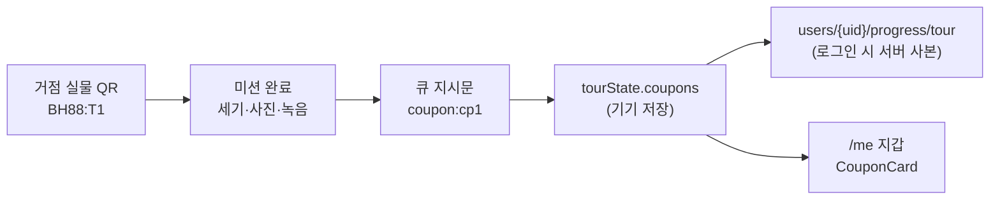
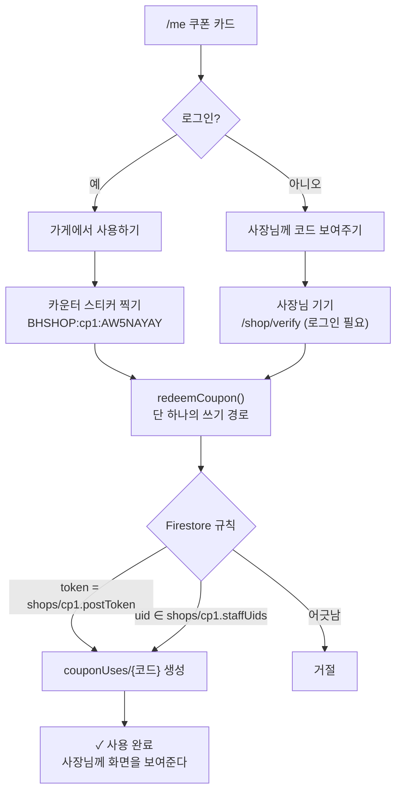
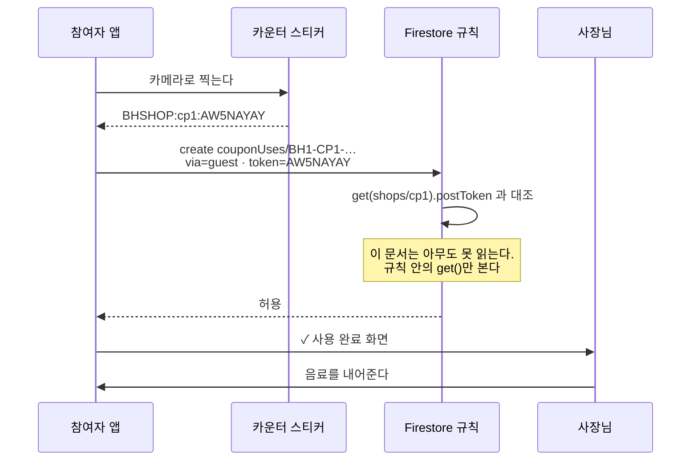
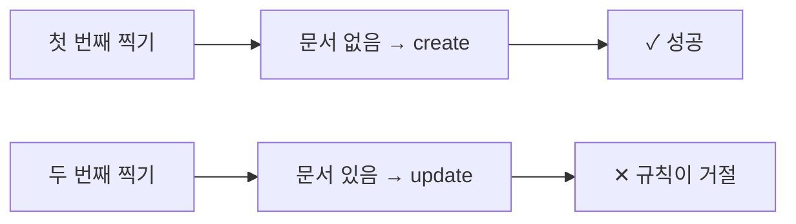
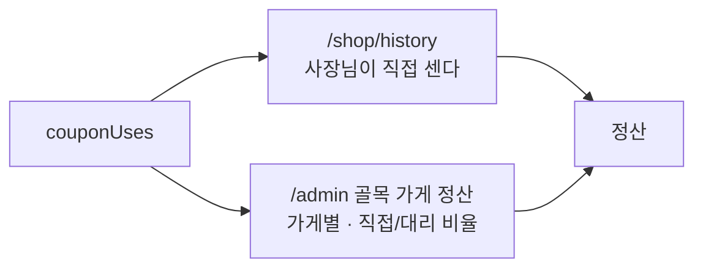

# 골목 가게 쿠폰 — 발행부터 정산까지

쿠폰이 어디서 생겨 어떻게 소진되고 어떻게 정산되는지. 코드는
`src/lib/coupons.ts`(코드 만들기) · `src/lib/shops.ts`(사용 처리) ·
`firestore.rules`(실제 방어)에 있다.

---

## 1. 발행 — 걷다 보면 쌓인다



**쿠폰은 서버가 발행하지 않는다.** 거점을 통과하면 기기에 `cp1`이라는
글자가 하나 쌓일 뿐이고, 실제 코드는 화면에서 만든다.

```
BH1-CP1-K3M9QF-237A
│   │   │      │ └ 체크값 2자 — 손으로 부를 때 오타를 잡는다
│   │   │      └── 발급 순번 2자 — 잘못 소진됐을 때 다음 장을 뜯는다
│   │   └───────── 사용자 6자 — uid를 접은 값(되돌릴 수 없다)
│   └───────────── 쿠폰 id
└───────────────── BH1 = 실제 · BH1T = 슈퍼관리자 시험용
```

> **체크값은 서명이 아니다.** 서버 비밀 없이 만드는 값이라 위조를 막지
> 못한다. 진짜 방어는 사용 기록과 규칙이다.

---

## 2. 사용 — 두 갈래, 쓰기 경로는 하나



### 주 경로 — 참여자가 가게 스티커를 찍는다



**이 한 줄이 시스템의 존재 이유다.** 토큰을 아는 유일한 방법이 카운터
앞에 서는 것이라, 그것이 '다녀왔다'의 증명이 된다. 서버가 없는 앱에서
쓸 수 있는 방법이 이것뿐이다.

### 보조 경로 — 사장님이 대신 처리한다

참여자 카메라가 안 되거나 계정이 없을 때. `/shop/verify`는 **가게 계정
로그인을 요구한다** — 예전에는 아무나 열 수 있어서 참여자가 가게에 오지
않고 자기 폰에서 태울 수 있었다.

---

## 3. 한 번만 쓰이는 이유



문서 id가 쿠폰 코드 전문이다. 규칙이 `create`만 열고 `update`를 막으므로,
**두 기기가 같은 코드를 동시에 찍어도 두 번째는 반드시 떨어진다.**
트랜잭션이 필요 없는 이유가 이것이다.

잘못 찍혀 소진됐다면 되돌리지 않는다 — 지갑의 [새 번호로 받기]가
순번을 올려 **다음 장을 뜯는다.** 앞 번호의 기록은 그대로 남는다.

---

## 4. 정산



**참여자 수로 추정하지 않고 실제 찍힌 장수로 센다.** `REWARD_COUPON_VALUE`
(4,000원)는 다섯 장을 다 썼을 때의 상한이지 나간 돈이 아니다.

`직접`(guest)과 `대리`(staff)를 갈라 보여준다. 대리는 손님이 오지 않아도
사장님 기기만으로 기록을 만들 수 있는 경로라, **한 가게 기록이 거의 전부
대리로 쌓이면 들여다볼 신호다.** 관리자 표에서 70%를 넘으면 붉게 표시된다.

---

## 5. 규칙이 막는 것

| 절 | 막는 것 |
|---|---|
| `create: if isSignedIn()` | 비로그인 아무나 쓰기 |
| `token == shops/{id}.postToken` | **가게에 가지 않고 태우기** |
| `uid in shops/{id}.staffUids` | 보조 경로 무단 사용 |
| `code.matches(...)` + 조각 교차검증 | 코드/필드 불일치, `BH1T` 시험코드 실소진 |
| `shops/{id}.couponId == couponId` | cp1 코드를 cp3에서 태우기, 폐점 가게 |
| `byUid == request.auth.uid` | 사칭 |
| `usedAt == request.time` | 정산 기간 조작 |
| `list`를 staffUids/관리자로 한정 | 장부 전체 공개, 남의 가게 매출 열람 |
| `update, delete: isAdmin()` | 사용 취소·시각 변조 |

---

## 6. 재사용 공격에 대한 판단

스티커는 사진 찍힐 수 있다. 그래도 **거의 문제가 되지 않는다** —
사용 처리는 물건을 주지 않는다. 물건은 카운터에서 사람이 준다.
원격으로 태우면 **자기 쿠폰만 없앤다.**

실제 위험은 반대쪽, **가게가 정산을 부풀리는 것**이다. 그래서 `via`를
남기고 관리자 표에 비율을 띄운다.

토큰이 샌 것 같으면 그 가게만 새로 뽑는다 — 촬영본이 전부 죽는다.

```bash
node scripts/make-shop-qr.mjs --rotate cp1
```

> 인자 없이 돌리면 **토큰이 지켜진다.** 매번 새로 만들면 이미 붙여둔
> 스티커가 조용히 죽고, 사장님은 "어제는 됐는데"라고만 말할 수 있다.
